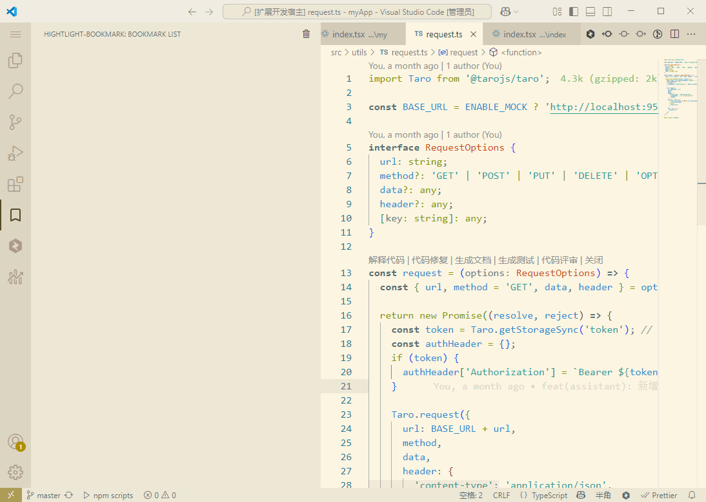

# Highlight Bookmark

一个强大的 VS Code 扩展，让你可以在代码中添加带有高亮显示的书签，帮助你更好地导航和组织代码。

A powerful VS Code extension that allows you to add highlighted bookmarks in your code, helping you better navigate and organize your codebase.

## 特性 / Features

- 📌 **书签高亮** / **Bookmark Highlighting**

  - 为书签行添加醒目的高亮显示
  - Add prominent highlighting to bookmarked lines

- 🎯 **快速导航** / **Quick Navigation**

  - 在书签之间快速跳转
  - Quickly jump between bookmarks

- ✨ **多光标支持** / **Multi-cursor Support**

  - 支持使用多光标同时添加多个书签
  - Support adding multiple bookmarks simultaneously using multi-cursor

- 📝 **书签备注** / **Bookmark Notes**

  - 可以为书签添加注释说明
  - Add notes to bookmarks for additional context

- 👀 **书签视图** / **Bookmark View**

  - 在侧边栏查看所有书签列表
  - View all bookmarks in the sidebar

- 🎨 **自定义样式** / **Custom Styling**

  - 可自定义书签高亮的颜色、样式和宽度
  - Customize the color, style, and width of bookmark highlights

- 💾 **状态保存** / **State Persistence**

  - 书签位置会被保存，重启 VS Code 后仍然存在
  - Bookmark positions are saved and persist after VS Code restart

- 🔄 **自动同步** / **Auto Sync**

  - 书签位置会随着文本编辑自动同步更新
  - Bookmark positions automatically sync with text edits

- 📊 **状态栏指示** / **Status Bar Indicators**
  - 当文件中有书签时，状态栏会显示导航按钮
  - Navigation buttons appear in the status bar when bookmarks exist

## 使用方法 / Usage

### 快捷键 / Keyboard Shortcuts

- `Alt+B` (Mac: `Option+B`)

  - 切换书签（支持多光标）
  - Toggle bookmark (supports multi-cursor)

- `Ctrl+Shift+B` (Mac: `Cmd+Shift+B`)

  - 清除当前文件中的所有书签
  - Clear all bookmarks in current file

- `F2`

  - 跳转到下一个书签（光标会移动到行尾）
  - Jump to next bookmark (cursor moves to line end)

- `Shift+F2`
  - 跳转到上一个书签（光标会移动到行尾）
  - Jump to previous bookmark (cursor moves to line end)

### 命令面板 / Command Palette

所有功能都可以通过命令面板（`Ctrl+Shift+P` / `Cmd+Shift+P`）访问，搜索 "highlight-bookmark" 即可看到所有可用命令：

All features can be accessed through the command palette (`Ctrl+Shift+P` / `Cmd+Shift+P`), search for "highlight-bookmark" to see all available commands:

- `Toogle Bookmarks`

  - 切换书签
  - Toggle bookmark

- `Clear All Bookmarks`

  - 清除所有书签
  - Clear all bookmarks

- `Clear Current File Bookmarks`

  - 清除当前文件的书签
  - Clear bookmarks in current file

- `Move cursor to the next bookmark`

  - 移动到下一个书签
  - Move to next bookmark

- `Move cursor to the previous bookmark`
  - 移动到上一个书签
  - Move to previous bookmark

### 书签视图 / Bookmark View

在活动栏中点击书签图标，可以打开书签视图面板：
Click the bookmark icon in the activity bar to open the bookmark view panel:

- **查看所有书签** / **View All Bookmarks**

  - 按文件分组显示所有书签
  - Display all bookmarks grouped by file

- **快速跳转** / **Quick Jump**

  - 点击书签项可直接跳转到对应位置
  - Click a bookmark item to jump to its location

- **添加备注** / **Add Notes**

  - 右键点击书签，选择"添加备注"为书签添加说明
  - Right-click a bookmark and select "Add Note" to add description

- **删除书签** / **Delete Bookmark**

  - 右键点击书签，选择"删除书签"
  - Right-click a bookmark and select "Delete Bookmark"

- **当前文件标记** / **Current File Indicator**

  - 当前活动文件在书签视图中会有特殊标记
  - Active file is specially marked in the bookmark view

- **内容预览** / **Content Preview**
  - 悬停在书签上可预览完整的行内容和备注
  - Hover over a bookmark to preview full line content and notes

### 多选区域操作 / Multi-selection Operations

- **选择多行添加书签** / **Add Bookmarks to Multiple Lines**

  - 选择多行后切换书签，可一次性为所有选中行添加书签
  - Select multiple lines and toggle bookmark to add bookmarks to all selected lines

- **选择多行删除书签** / **Remove Bookmarks from Multiple Lines**
  - 如果选中区域内已有书签，切换操作会删除这些书签
  - If selected lines contain bookmarks, toggle operation will remove them

### 状态栏功能 / Status Bar Features

当文件中有书签时，状态栏会显示：
When bookmarks exist in a file, the status bar shows:

- 上一个书签按钮 / Previous Bookmark Button

  - 点击跳转到上一个书签
  - Click to jump to previous bookmark

- 下一个书签按钮 / Next Bookmark Button
  - 点击跳转到下一个书签
  - Click to jump to next bookmark

## 配置选项 / Configuration Options

在 VS Code 设置中，你可以自定义以下选项：
In VS Code settings, you can customize the following options:

- `lineHighlightBookmark.alignTopOnNavigation`

  - 导航时是否将书签行置顶显示
  - Whether to align bookmarked line to top when navigating
  - 默认值 / Default: `false`

- `lineHighlightBookmark.renderLine`

  - 是否显示书签行的高亮效果
  - Whether to show highlight effect for bookmarked lines
  - 默认值 / Default: `true`

- `lineHighlightBookmark.lineColor`

  - 高亮线条的颜色
  - Color of the highlight line
  - 默认值 / Default: `#F44336`
  - 支持格式 / Supported formats: 'red', '#FFF', '#FFFFFF', 'RGB(255,255,255)', 'RGB(255,255,255,0.5)'

- `lineHighlightBookmark.lineWidth`

  - 高亮线条的宽度
  - Width of the highlight line
  - 默认值 / Default: `1px`

- `lineHighlightBookmark.lineStyle`
  - 高亮线条的样式
  - Style of the highlight line
  - 默认值 / Default: `solid`
  - 可选值 / Available options:
    - `solid` - 实线 / Solid line
    - `dashed` - 虚线 / Dashed line
    - `inset` - 内嵌 / Inset line
    - `double` - 双线 / Double line
    - `groove` - 凹槽 / Grooved line
    - `outset` - 外凸 / Outset line
    - `ridge` - 脊线 / Ridge line

## 高级功能 / Advanced Features

### 书签备注 / Bookmark Notes

为书签添加备注可以帮助你记录重要信息：
Add notes to bookmarks to help record important information:

1. 在书签视图中右键点击书签，选择"添加备注"
   Right-click a bookmark in the bookmark view and select "Add Note"

2. 输入备注内容并确认
   Enter note content and confirm

3. 备注会显示在书签项旁边，并在悬停时显示完整内容
   Note will appear next to the bookmark and show full content on hover

### 书签持久化 / Bookmark Persistence

书签位置会被保存到工作区状态中，即使关闭 VS Code 后重新打开，书签也会保持在原来的位置。
Bookmark positions are saved in workspace state and persist even after VS Code is closed and reopened.

### 自动同步 / Auto Synchronization

当你编辑文件内容时，书签位置会自动同步更新，确保书签始终标记在正确的代码行上。
When you edit file content, bookmark positions automatically sync to ensure bookmarks always mark the correct code lines.

## 贡献 / Contributing

欢迎提交 Issue 和 Pull Request 到 [GitHub 仓库](https://github.com/denjay/highlight-bookmark)。

Feel free to submit issues and pull requests to the [GitHub repository](https://github.com/denjay/highlight-bookmark).

## 许可证 / License

此扩展遵循 MIT 许可证。
This extension is licensed under the MIT License.
